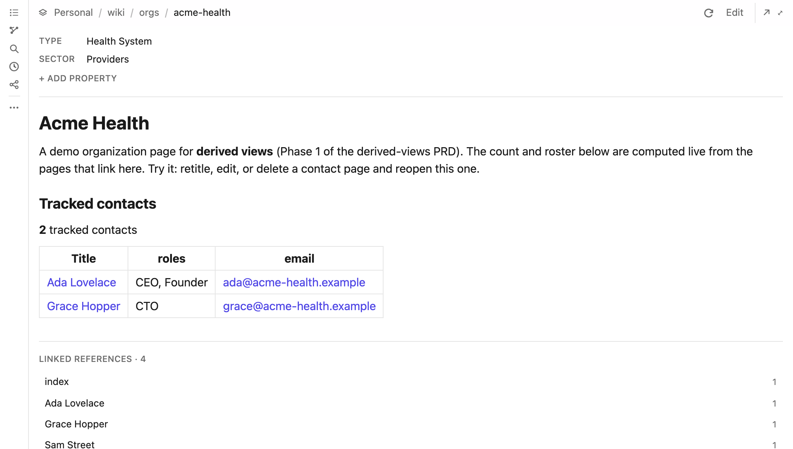
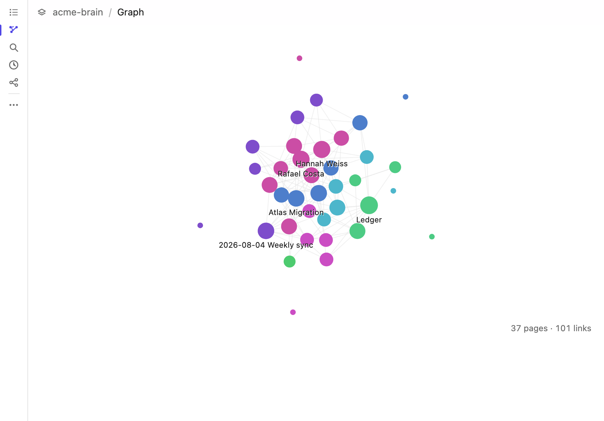
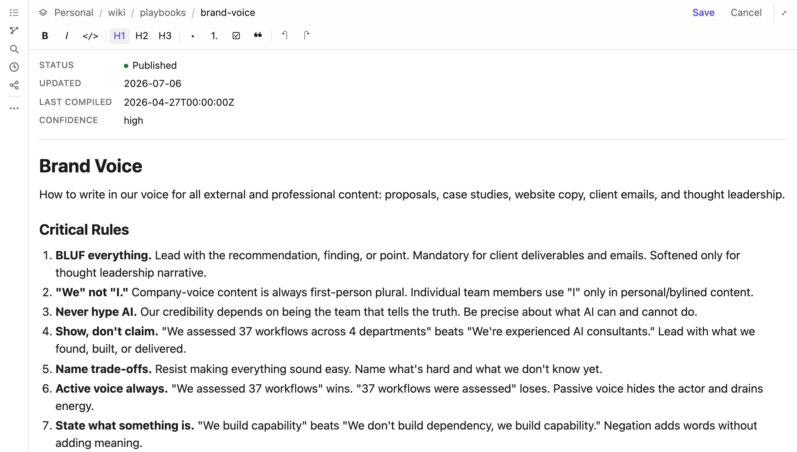

# Isomorphic

**A team knowledge base that lives in a GitHub repository, and that Claude, or any MCP client,
can search, read, edit, and render as an interactive app inside the conversation.**

Your knowledge is markdown in a git repo you own. Isomorphic is the layer that lets an LLM
maintain it: a Model Context Protocol server with a librarian's toolkit, a content index that
keeps reads fast at any size, computed views, and an in-client viewer and WYSIWYG editor so a
non-technical teammate never has to open GitHub.



[Getting started](docs/getting-started.md) · [Self-hosting](docs/self-hosting.md) ·
[Architecture](docs/architecture.md) ·
[Licensing](docs/licensing.md) · [Contributing](CONTRIBUTING.md) ·
[Invariants](CLAUDE.md) · [Roadmap](docs/roadmap.md)

**Try it in two minutes, with no accounts:**

```sh
git clone https://github.com/isomorphic-team/isomorphic-app
cd isomorphic-app && pnpm install
pnpm try ~/Documents/notes     # any folder of markdown; an Obsidian vault works
```

The real MCP server, the real librarian tools, and the real content index, against a git
repository on your disk. No GitHub account, no Cloudflare account, no tokens. Connect it
with `claude mcp add --transport http isomorphic-local http://127.0.0.1:8788/mcp`, or open
`http://127.0.0.1:8788/b/local/notes` in a browser for the same viewer and editor with no
MCP host at all.

**To self-host for a team you need:** a Cloudflare account (Workers, D1, KV; the free tier is
enough for a small team), a GitHub repository for the brain, and a GitHub token or GitHub App.
For one person on one machine, `pnpm try` above needs only Node 24 and git. There is no Docker
image and no Postgres path; Cloudflare is the only supported deploy target for a shared
instance. [Self-hosting](docs/self-hosting.md) has the four paths, from two minutes to two hours.

## Why not a folder of markdown and a coding agent?

You can point Claude Code at a folder of notes today, and for one person that is a fine place
to start. Isomorphic is for what goes wrong after that:

- **Moving a page breaks every link to it.** `move_page` repoints each inbound link, markdown
  and wikilink alike, in the same commit. `delete_page` tells you what still points at the page.
- **An agent rewrites a whole page to change one paragraph.** `write_page` takes exact
  find-and-replace edits and appends. An anchor that matches zero or several times aborts the
  whole call, so a batch is never half-applied and a page is never silently clobbered.
- **Reads stop scaling.** A derived content index keeps search, backlinks, validation, and the
  graph to one or two queries on a 3,000-page brain, and checks the branch HEAD on every read so
  an edit made on github.com or by another agent is never served stale.
- **Listings drift.** A fenced `okf-view` block is a listing, table, or count computed from
  backlinks or frontmatter, recomputed on every read instead of maintained by hand.
- **Half the team will never open a terminal or GitHub.** The viewer and editor render inside
  the conversation and in a browser tab. Teammates sign in with an email link, nobody needs a
  GitHub account, and orgs, roles, invitations, and per-brain sharing are all in this repository.

## What works where

The server never calls a model. It is an MCP server; the client brings the model, and any
client that speaks the protocol works.

| Surface                                                                                          | Works with                                                                                                                                                                                                                                                                                         |
| ------------------------------------------------------------------------------------------------ | -------------------------------------------------------------------------------------------------------------------------------------------------------------------------------------------------------------------------------------------------------------------------------------------------- |
| **The tools:** search, read, write, move, validate, computed views, import, brain-authored tools | Any MCP client over Streamable HTTP, with OAuth 2.1 or a bearer token: claude.ai, Claude Code, Claude Desktop, the MCP Inspector, and anything else that speaks MCP.                                                                                                                               |
| **The in-conversation app:** viewer, WYSIWYG editor, file tree, graph, activity, roster          | Hosts that implement the [MCP Apps](https://modelcontextprotocol.io/extensions/apps/overview) extension. claude.ai renders it; the MCP Inspector and VS Code Copilot do too, which is how we tell a host problem from a server problem. In a host without it the tools still work and return text. |
| **The same app in a browser tab**                                                                | Any browser, no MCP host: `/b/<owner>/<repo>/<path>` on a multi-tenant deployment, signed in with the same email link, and `/b/local/<folder>` from `pnpm try`.                                                                                                                                    |
| **Reading and editing the brain itself**                                                         | Anything that reads markdown: github.com, Obsidian, `grep`, a pull request. The brain is a plain git repository and needs none of this software.                                                                                                                                                   |

> Open source under [AGPL-3.0-only](LICENSE). Run it, fork it, deploy it for your own company,
> sell services around it. If you modify it and let others use your version over a network,
> you owe those users your changes. Your knowledge base is your data and the license does not
> reach it. [`docs/licensing.md`](docs/licensing.md) has the detail, including commercial
> licensing if the AGPL does not work for you.

---

## Why this exists

Writing knowledge down is a separate job from doing the work, which is why it does not get
done. LLMs are good at that separate job and bad at doing it into a database whose shape they
cannot see.

So the substrate is one markdown file per concept, in a normal git repository, in the
[Open Knowledge Format](https://github.com/GoogleCloudPlatform/knowledge-catalog/blob/main/okf/SPEC.md).
You can read it on github.com, edit it in Obsidian, grep it, diff it, and review a change in a
pull request. If you stop using Isomorphic tomorrow you still have everything.

## Features

Every tool is listed, grouped by what it is for. The gate each one sits behind is in
[Permissions](#permissions).

### Read and search

- **`search_pages`**: ranked full-text search over the content index. Terms are ORed and scored
  by coverage, so a question-shaped query still finds the page that answers half of it. The
  response says which terms it searched and what it left out.
- **`read_page`** / **`view_page`**: the raw markdown for the model, or the rendered page in the
  app for the person. Kept separate so an agent can read quietly.
- **`list_pages`** / **`browse_brain`**: the tree, or a summary of the brain's shape with the
  tree attached while it is small.
- **`find_inbound_links`**: every page pointing at a page, in both link syntaxes.
- **`view_graph`**: the link graph, optionally focused on one page.
- **`view_activity`**: who changed what, when, for the brain or for one page.
- **`validate`**: broken links (defects, never silenced) plus advisory findings: concepts
  inlined as sections of a folder note, pages missing a `type:`, two pages answering to one
  title, orphans, folder notes that list none of their pages, two pages telling the same story,
  and unanswered import questions. **`resolve`** records a decision on any finding by its key
  so it stops being reported.
- **`whoami`**: who the server thinks you are, in which org, at which roles.

All reads query a derived index in D1 rather than GitHub, and every read compares the branch
HEAD to the indexed commit first, so a page edited on github.com, by another agent, or by a
merged pull request is never served stale. No webhook required.

### Write

- **`write_page`**: create or update. `content` replaces the body; `edits` is a list of exact
  find-and-replace pairs; `append` adds at the end; `fields` sets or removes frontmatter keys
  without touching the body; `type` is the one field OKF requires. An edit anchor that matches
  zero or several times aborts the whole call, so a batch is never half-applied.
- **`move_page`**: move or rename a page or a whole folder, repointing every inbound link,
  markdown and wikilink, in the same commit.
- **`delete_page`**: delete a page or folder, and report what still links to it.
- **`edit_page`**: open the page in [the editor](#the-editor).
- **`attach_media`** / **`read_media`**: images and PDFs, fetched from a URL by the server or
  uploaded from the app, stored in the repo and optionally embedded in a page.
- **`configure_brain`**: tell an adopted repository where its content lives, for a repo whose
  markdown sits under `docs/` or elsewhere. Writes `.isomorphic.json`, which also holds the
  optional list of frontmatter keys to index.

Every write is one atomic commit, or a pull request when the default branch is protected,
detected automatically. An identical retry inside ten minutes, the kind a client
sends after a gateway timeout, is answered from a ledger rather than applied twice, so a
retried append does not duplicate and a retried create does not fail claiming the page exists.

### Computed views

A fenced ` ```okf-view ` block declares a listing, a table, or a count, derived from backlinks
or from the pages under a prefix, filtered and grouped by frontmatter. Executing consumers
always compute it live. A cached snapshot is written into the file so that github.com and other
plain-markdown readers still see a real table; it is allowed to go stale, because whatever
reads it cannot compute.

### Tools your brain defines

Any page under a `tools/` folder becomes an MCP tool named `tool_<filename>`, declared in a
small fenced block. Three read-only kinds: return an instruction payload, run one whitelisted
read, or render one view. Arguments are interpolated as data and never evaluated, and a
brain-authored tool cannot exceed its caller's access. These are written conversationally,
which means Claude authoring Claude's own future tools. Capped at 25 per brain.

### Bulk import

- **`sync_records`**: upsert from a spreadsheet or CRM by key, without clobbering human edits.
  Only declared source-owned fields are written, the body is written at create only, deletions
  are proposed rather than applied, and a page a human deleted is never silently resurrected.
  Unanswered questions persist and surface in `validate` until `resolve` answers them.

### Several brains

- **`brains`** / **`switch_brain`**: the switcher, and the brain every later call targets. Every
  tool also takes an explicit `brain` argument.
- **`create_brain`**: scaffold a fresh repository under the org and switch to it.
- **`connect_brain`** / **`disconnect_brain`**: adopt an existing repository of markdown, or
  drop it from the org (the repository itself is untouched).

### The app

The app is an [MCP App](https://modelcontextprotocol.io/extensions/apps/overview): the server
declares one `ui://` HTML resource, the widget tools link to it, the host renders it in a
sandboxed iframe, and the iframe calls the same tools back over `tools/call`. It has no
privileges of its own. Everything it shows or changes goes through a tool the model could also
call, at the caller's role, so the app is structurally incapable of doing something the
connector cannot. The same bundle is served as a web page at `/b/<owner>/<repo>/<path>` for
people who are not in the conversation, signed in with the same email link.

What is in it:

- **Viewer.** Rendered markdown with clickable links in both syntaxes, wikilinks resolved by
  the same function `validate` uses, so a link the viewer refuses to open is one validate
  reports. Frontmatter renders as a properties panel, editable in place. Computed views render
  live. Linked references at the foot of every page. A refresh control that reports the page's
  age and says so when the page moved underneath you.
- **File tree.** Clicking a folder opens its folder note (`index.md`) when it has one; a
  note-less folder offers to create one, pre-seeded with a directory view.
- **Search**, with ranked hits and the lines that matched.
- **Link graph**, nodes sized by degree and colored by folder, focusable on one page.
- **Activity feed**: who changed what and when, for the brain or for one page.
- **Brain switcher**, when you can reach more than one.
- **Sharing panel, member roster, analytics** for the org-scope tools, with their controls
  shown only at the role that can use them.
- **Three display modes** (inline card, fullscreen, picture-in-picture), light and dark
  themes following the host, and reduced-motion support.



### The editor

A WYSIWYG editor over the page body, built on ProseMirror. What it saves is the markdown you
would have written by hand, which is the whole design constraint: a brain is read on
github.com, in Obsidian, and by agents, and an editor that reformats every page it touches
would make every diff unreadable.

- **Formatting:** headings, bold, italic, inline code, bullet and numbered lists, checklists,
  blockquotes, and GFM tables with column resizing. Undo and redo, with keyboard shortcuts.
- **Images:** paste or drop a file into the body. It uploads through `attach_media`, lands in
  the repo beside the page, and is embedded as an ordinary relative image link. Save is held
  until the upload finishes so a page never links to a file the brain does not have.
- **Round trip.** `pnpm test:roundtrip` is a golden test over the brain's own conventions: `-`
  bullets rather than `*`, `[[wikilinks]]` kept byte-stable rather than backslash-escaped,
  tables preserved rather than destroyed. Frontmatter is never sent to the editor at all, so
  nested blocks, provenance, and unknown keys survive a save untouched.
- **Computed views** are stripped before the body reaches the editor and regenerated on save,
  so generated content never round-trips through ProseMirror.
- **Concurrency.** Every save carries the sha the editor opened, and the server refuses a
  save over a page someone else changed first, keeping your text on screen rather than
  overwriting theirs. On a protected branch the save opens a pull request, and the editor says
  so instead of claiming the change is live.



### Organization

- **`members`**, **`invite_member`**, **`set_member_role`**, **`remove_member`**: the roster,
  email invitations (no GitHub account needed), and org roles.
- **`brain_access`** / **`share_brain`**: who can open a brain and at what level; grant,
  change, revoke, and flip a brain between private and org-visible.
- **`connect_github_org`**: install the GitHub App on a customer's own org so their brains live
  in repositories they own.
- **`connected_accounts`**, **`link_identity`**, **`unlink_identity`**: one person, several
  email addresses, one set of brains.
- **`analytics`**: is the organization using its brains, and who is not. Per-day counters in
  the deployment's own database, never sent anywhere.
- **`submit_feedback`**: file a bug or idea on the project tracker from inside the
  conversation, with nothing identifying published.

All of it is in this repository and all of it is configuration rather than a hosted-only tier.
See [the open-source boundary](docs/design/open-source-boundary.md).

## Permissions

Four roles, ordered: **`viewer < editor < admin < owner`**. Two scopes, deliberately separate,
because "can you manage this organization's people?" and "can you write in this brain?" are
different questions:

- **Org role** comes from membership in the organization. It governs people and which brains
  exist.
- **Brain role** is what you can do inside one brain. It is the highest of three sources: your
  org role if the brain is org-visible, an explicit share, and an admin floor (an org admin or
  owner is at least admin on every brain in the org, since they control the GitHub org that
  physically holds it). A share can only raise access, never lower it.

| Action                                                                | Needs            |
| --------------------------------------------------------------------- | ---------------- |
| Read, search, browse, graph, activity, validate, brain-authored tools | brain **viewer** |
| Write, move, delete pages; attach media; import; resolve findings     | brain **editor** |
| Configure the brain; share it; make it private or org-visible         | brain **admin**  |
| Create a brain                                                        | org **editor**   |
| Connect or disconnect a repository; connect the GitHub org            | org **admin**    |
| Invite, change roles, remove members                                  | org **admin**    |
| Analytics totals and the per-brain table                              | org **viewer**   |
| Analytics per-person table                                            | org **admin**    |

A brain is **private** to whoever created or adopted it by default, whether it came from
`create_brain` or `connect_brain`; widening it to the org is one `share_brain` call, and the
response says which it is. Sharing stays inside the brain's org, never grants above your own brain
role, and never lets you revoke yourself. `owner` is the org's anti-lockout anchor: it is never
assignable, demotable, or removable, and nobody can edit their own membership. A brain whose
default branch is protected gets pull requests instead of commits, whatever the caller's role.

The single-tenant deployment (`AUTH_MODE=static`, one shared bearer token) and the local
runtime (`pnpm try`) have no org model: every caller is `owner`, and the org tools are not
registered at all rather than advertised and refused. The rule itself is one pure function,
`effectiveBrainRole`, and `pnpm test:access` walks its whole input space; `pnpm test:scope` pins
which of the two roles each tool gates on, in both directions.

## Use it

Add it to Claude as a custom connector. **Settings → Connectors → Add custom connector**,
and paste the MCP endpoint of an Isomorphic server. For the hosted service run by
Isomorphic:

```
https://mcp.isomorphic.sh/mcp
```

No client ID, no client secret, and no GitHub account. Claude registers itself and sends you
through an email magic link, then you ask it to create your first brain.
[**docs/getting-started.md**](docs/getting-started.md) has the full walkthrough, the same
steps against your own deployment, other MCP hosts, and what to check when it does not work.

## Run it locally in five minutes

No accounts, no Cloudflare, no GitHub App:

```sh
git clone https://github.com/isomorphic-team/isomorphic-app
cd isomorphic-app
pnpm install
pnpm setup:config       # generate wrangler.jsonc for local development
pnpm test               # the full suite, offline
pnpm app:dev            # http://localhost:5175, the real app UI over fixtures
```

To run a server against your own GitHub org, see
[**docs/self-hosting.md**](docs/self-hosting.md). The short version is `pnpm bootstrap`, which
registers a GitHub App from a manifest and scaffolds your first brain repository in one atomic
commit, in about three clicks.

## How it is built

Three programs share one `src/`:

- **The MCP Worker** (`src/worker.ts`) runs on Cloudflare Workers and is the product. Stateless
  Streamable HTTP: a fresh server and transport per request, answering on the same POST. D1 for
  the content index and the org tables, KV for OAuth state. It also serves the app as a web page.
- **The local runtime** (`src/local.ts`) is `pnpm try`: the same tools and the same app over a
  git repository on disk, on Node, with no accounts. One person, one machine, no org model.
- **The bootstrap server** (`src/bootstrap.ts`) runs once on Node to register the GitHub App and
  scaffold the first brain.

The split is load-bearing: anything under `src/lib/` is imported by both, so it **cannot use
`node:*` modules**. Four tsconfigs enforce it and `pnpm typecheck` runs all four.

A brain repository is:

```
your-brain/
├── AGENTS.md            # the contract agents read (see brain-template/AGENTS.md)
├── .isomorphic.json     # which paths are content, which are immutable source, where the log is
├── source/              # immutable source material
└── wiki/                # editable content, arbitrary folders, no fixed entity types
    └── log.md           # tool-maintained changelog
```

There is no entity taxonomy. Folders are whatever you want, because the brains this serves
belong to different companies who organize differently. `type:` in frontmatter is a free-form
string, required by OKF, and used to force the "is this a concept or a record" question. A
folder containing `index.md` **is** that page, which is how directory notes work.

[**`CLAUDE.md`**](CLAUDE.md) is the architecture document. Maintainers keep it current because
coding agents read it, and it explains why each design is what it is, including the failures
that produced the rule. Read the relevant section before changing something.
[`docs/references.md`](docs/references.md) lists the authoritative external sources, which move
faster than any model's training data.

## Commands

```sh
pnpm try <folder>       # local runtime: MCP over a git repo on disk, no accounts
pnpm doctor             # what this checkout has, and what to run next
pnpm setup:config       # generate wrangler.jsonc (--provision to create Cloudflare resources)
pnpm bootstrap          # one-shot GitHub App registration + brain scaffold
pnpm app:dev            # app UI dev server, no credentials needed
pnpm worker:dev         # the MCP Worker at http://localhost:8787/mcp
pnpm worker:deploy      # publish to Cloudflare
pnpm gen:app            # regenerate the ui:// bundle (after editing app/)
pnpm gen:templates      # regenerate the brain templates (after editing brain-template/)
pnpm db:migrate         # apply D1 migrations locally
pnpm test               # the full suite, offline
pnpm typecheck          # all four tsconfigs
pnpm format             # prettier
```

`pnpm test` includes two end-to-end batteries that drive the real tool handlers against a git
repo in a temp directory. The same two run against real GitHub with `--github`, which needs
platform App credentials and creates a disposable scratch repository it deletes afterwards.

## Contributing

Contributions are welcome. [`CONTRIBUTING.md`](CONTRIBUTING.md) covers how to get it running,
the three invariants that will bite you, and what we will and will not merge. Contributors sign
a [CLA](CLA.md), which is one bot comment and does not take your copyright.

[`docs/roadmap.md`](docs/roadmap.md) is what is planned. [`GOVERNANCE.md`](GOVERNANCE.md) says
who decides what.

Found a security problem? [`SECURITY.md`](SECURITY.md). Please do not open a public issue.

## License

[GNU AGPL-3.0-only](LICENSE), an [OSI-approved](https://opensource.org/licenses) open source
license. Self-host freely with no obligations. Modify it and let others use your version over a
network, and you owe those users your source. Your brain is your data and the license does not
reach it; neither does it reach MCP clients, which talk to the server over a protocol rather
than linking against it.

What the AGPL does and does not require, and why we chose it over Apache, FSL, and BSL:
[`docs/licensing.md`](docs/licensing.md).

Contributors sign a [CLA](CLA.md) so we can also offer Isomorphic commercially to organizations
that cannot ship copyleft. In exchange the CLA binds us to keep every contribution under an
OSI-approved license, permanently. If the AGPL does not work for you, **legal@isomorphic.sh**.
